# CAIS BACKEND — FULL SYSTEM ARCHITECTURE

> **Project**: Laravel 12 | PHP ^8.2 | Multi-tenant business management (Sales, HR, Quotation, PKS, SPK)  
> **Models**: 94 | **Controllers**: 46 | **Services**: 13 | **DTOs**: 3 | **Resources**: 3 | **Requests**: 14  
> **Database**: MySQL `shelter3_cais` + MySQL `shelter3_hris` (dual connection)

---

## 1. INFRASTRUCTURE & CONFIG

### Database Dual Connection

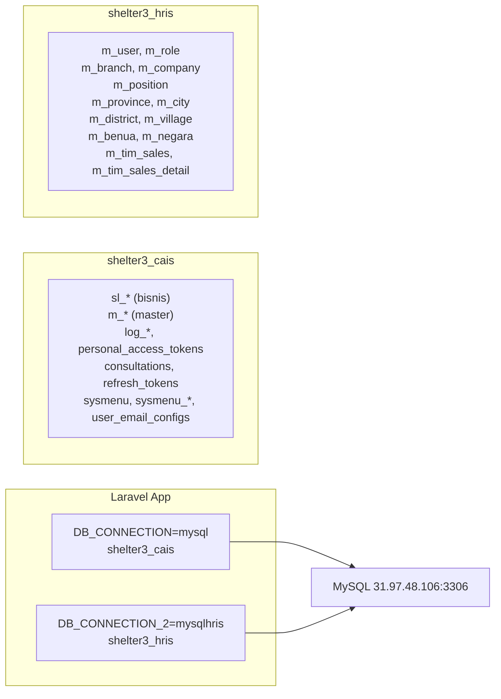

### Auth Stack

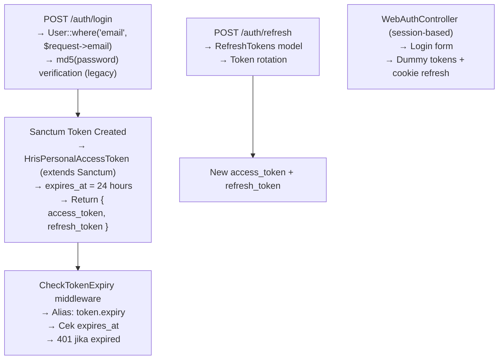

### Middleware Stack (bootstrap/app.php)

```
API Group:
  → ApiResponseMiddleware (set Accept: application/json)
  → EncryptCookies
  → StartSession
  → ShareErrorsFromSession
  → SubstituteBindings
  → CheckTokenExpiry (alias: token.expiry)
  → auth:sanctum,web (route-level)
```

---

## 2. FULL ROUTE MAP

```mermaid
graph LR
    subgraph PUBLIC["Public (No Auth)"]
        AUTH_LOGIN["POST /auth/login<br/>POST /auth/refresh"]
        CONSULT["GET/POST /admin-panel/consultations"]
    end

    subgraph AUTH["Authenticated (40+ route groups)"]
        AUTH_ME["POST /auth/logout<br/>GET /auth/user"]
        
        MASTER_A["Master Data A:<br/>jenis-perusahaan<br/>bentuk-usaha<br/>jenis-barang<br/>barang<br/>kebutuhan<br/>position<br/>training"]
        MASTER_B["Master Data B:<br/>management-fee<br/>top<br/>salary-rule<br/>tunjangan<br/>supplier<br/>menu"]
        WAGE["Wage Data:<br/>ump, umk, upah<br/>(UMP/UMK/UMSK/UMSP)"]
        
        LEADS["/leads<br/>✓ Full CRUD<br/>✓ assignSales, removeSales<br/>✓ childLeads<br/>✓ import/export excel<br/>✓ getPksByLead, getSpkByLead<br/>✓ availableQuotation"]
        CUSTOMER["/customer<br/>✓ list, view, available"]
        CUST_ACT["/customer-activities<br/>✓ CRUD + track + sendEmail"]
        SALES_ACT["/sales-activity<br/>✓ CRUD + stats"]
        TIM_SALES["/tim-sales<br/>✓ CRUD + members + stats"]
        SALES_TARGET["/sales-targets<br/>✓ API Resource"]
        SALES_REV["/sales-revenue<br/>✓ monthly, summary, kpi"]
        
        QUOTATION["/quotations<br/>✓ CRUD + copy/resubmit<br/>✓ submit-approval + reset-approval<br/>✓ calculate + export-pdf<br/>✓ available-leads + reference"]
        QUOTATION_STEP["/quotations-step<br/>✓ getStep + updateStep (12 steps)"]
        
        PKS["/pks<br/>✓ CRUD + approve + activate<br/>✓ perjanjian (template/history/compare)<br/>✓ upload + submit-checklist<br/>✓ storePasal, destroyPasal"]
        SPK["/spk<br/>✓ CRUD + cetak + upload<br/>✓ ajukan-ulang<br/>✓ site management"]
        SITE["/site<br/>✓ list, view, available-customer"]
        
        DASHBOARD["/dashboard-approval<br/>/dashboard-pks"]
        REPORT["/sales-report<br/>✓ monthly, weekly, activity-detail"]
        
        COMPANY_GROUP["/company-group<br/>✓ CRUD + bulk assign"]
        SUBMISSION["/submission<br/>/submission-v2"]
        ANNOUNCEMENT["/system-announcements<br/>/v2/system-announcements"]
        
        ADMIN["/admin-panel<br/>✓ Step data + bypass updates"]
        OPTIONS["/options<br/>✓ 20+ master data endpoints"]
    end

    PUBLIC --> AUTH
```

---

## 3. MODULE MAP — DATABASE RELATIONSHIPS

```mermaid
erDiagram
    %% LEADS MODULE
    sl_leads ||--o{ sl_leads_kebutuhan : "has"
    sl_leads ||--o{ sl_quotation : "has"
    sl_leads ||--o{ sl_pks : "has"
    sl_leads ||--o{ sl_spk : "has"
    sl_leads ||--o{ sl_customer_activity : "has"
    sl_leads ||--o{ sl_activity_sales : "has"
    sl_leads ||--o{ sl_quotation_site : "has"
    sl_leads ||--o{ sl_submission : "has"
    sl_leads }o--|| m_status_leads : "status"
    sl_leads }o--|| m_branch : "branch"
    sl_leads }o--|? m_platform : "platform"
    sl_leads }o--|? sl_customers : "customer"
    
    %% SALES TEAM
    m_tim_sales ||--o{ m_tim_sales_detail : "has"
    m_tim_sales_detail }o--|| m_user : "user"
    sl_leads_kebutuhan }o--|? m_tim_sales_detail : "tim_sales_d"
    sl_leads_kebutuhan }o--|| m_kebutuhan : "kebutuhan"
    
    %% QUOTATION MODULE
    sl_quotation ||--o{ sl_quotation_detail : "has"
    sl_quotation ||--o{ sl_quotation_site : "has"
    sl_quotation ||--o{ sl_site : "has (via sites)"
    sl_quotation ||--o{ sl_quotation_pic : "has"
    sl_quotation ||--o{ sl_quotation_kaporlap : "has"
    sl_quotation ||--o{ sl_quotation_devices : "has"
    sl_quotation ||--o{ sl_quotation_chemical : "has"
    sl_quotation ||--o{ sl_quotation_ohc : "has"
    sl_quotation ||--o{ sl_quotation_aplikasi : "has"
    sl_quotation ||--o{ sl_quotation_kerjasama : "has"
    sl_quotation ||--o{ sl_quotation_training : "has"
    sl_quotation ||--o{ sl_quotation_management_fee : "has"
    sl_quotation }o--|| m_status_quotation : "status"
    sl_quotation }o--|| m_company : "company"
    sl_quotation }o--|| m_kebutuhan : "kebutuhan"
    sl_quotation }o--|| m_management_fee : "management_fee"
    sl_quotation }o--|| m_salary_rule : "salary_rule"
    
    sl_quotation_detail ||--o{ sl_quotation_detail_hpp : "has"
    sl_quotation_detail ||--o{ sl_quotation_detail_coss : "has"
    sl_quotation_detail ||--o{ sl_quotation_detail_wage : "has"
    sl_quotation_detail ||--o{ sl_quotation_detail_tunjangan : "has"
    sl_quotation_detail ||--o{ sl_quotation_detail_requirement : "has"
    sl_quotation_detail }o--|| m_position : "position"
    
    %% PKS MODULE
    sl_pks ||--o{ sl_pks_perjanjian : "has"
    sl_pks_perjanjian ||--o{ sl_pks_perjanjian_history : "has"
    sl_pks ||--o{ sl_site : "has"
    sl_pks ||--o{ log_approval : "has (polymorphic)"
    sl_pks }o--|| m_status_pks : "status"
    
    %% SPK MODULE
    sl_spk ||--o{ sl_spk_site : "has"
    sl_spk_site }o--|| sl_quotation_site : "quotation_site"
    sl_spk }o--|| m_status_spk : "status"
    
    %% SITE
    sl_site }o--|| sl_quotation : "quotation"
    sl_site }o--|| sl_pks : "pks"
    sl_site }o--|| sl_spk : "spk"
    
    %% LOGGING
    log_approval }o--|| sl_quotation : "doc_id (tabel=quotation)"
    log_approval }o--|| sl_pks : "doc_id (tabel=pks)"
    log_notification }o--|| m_user : "user_id"
    
    %% REFERENCE / MASTER
    m_kebutuhan ||--o{ m_kebutuhan_detail_tunjangan : "has"
    m_kebutuhan ||--o{ m_kebutuhan_detail_requirement : "has"
    m_kebutuhan ||--o{ m_position : "has"
    m_barang ||--o{ m_barang_default_qty : "has"
    m_barang }o--|| m_jenis_barang : "jenis"
    m_province ||--o{ m_city : "has"
    m_province ||--|| m_ump : "has active"
    m_city ||--|| m_umk : "has active"
    m_user }o--|| m_role : "cais_role"
    m_user }o--|| m_branch : "branch"
    m_user ||--o{ personal_access_tokens : "has"
    personal_access_tokens ||--|| refresh_tokens : "has"
```

---

## 4. DIRECTORY STRUCTURE

```
project-cais-backend/
├── app/
│   ├── Console/
│   │   └── Commands/          # (Custom commands - currently empty)
│   ├── DTO/                   # 3 Data Transfer Objects
│   │   ├── CalculationSummary.php
│   │   ├── DetailCalculation.php
│   │   └── QuotationCalculationResult.php
│   ├── Enums/
│   │   └── ProvinceDetailType.php
│   ├── Events/
│   │   └── QuotationCreated.php
│   ├── Exceptions/            # (Custom exceptions)
│   ├── Http/
│   │   ├── Controllers/       # 46 controllers
│   │   ├── Middleware/        # 2 middleware
│   │   ├── Requests/          # 14 form requests
│   │   └── Resources/         # 3 API resources
│   ├── Jobs/
│   │   └── EscalateQuotationJob.php
│   ├── Listeners/
│   │   └── ProcessQuotationDuplication.php
│   ├── Mail/                  # 3 mailables
│   ├── Models/                # 94 models
│   ├── Providers/             # 4 service providers
│   └── Services/              # 13 services
│       ├── AddendumService.php
│       ├── DocumentCompressionService.php
│       ├── DynamicMailerService.php
│       ├── PksPerjanjianTemplateService.php
│       ├── QuotationBarangService.php
│       ├── QuotationBusinessService.php
│       ├── QuotationDuplicationService.php
│       ├── QuotationNotificationService.php
│       ├── QuotationService.php
│       ├── QuotationStepService.php
│       ├── SalesRevenueService.php
│       └── UpahService.php
├── bootstrap/
│   └── app.php                # Middleware + Sanctum config
├── config/
│   ├── app.php, auth.php, cache.php, cors.php
│   ├── database.php, filesystems.php, logging.php
│   ├── l5-swagger.php, mail.php, queue.php
│   ├── sanctum.php, services.php, session.php
│   └── telescope.php
├── database/
│   ├── factories/
│   ├── migrations/            # 13 migration files
│   └── seeders/
├── docs/                      # (Documentation)
├── resources/
│   └── views/                 # (Blade templates)
├── routes/
│   ├── api.php                # 576 lines - all API routes
│   ├── console.php
│   └── web.php
├── storage/
├── tests/
│   ├── Feature/
│   └── Unit/
├── .env                       # DB credentials + config
├── AGENTS.md                  # Project conventions
└── composer.json
```

---

## 5. CORE MODULE: QUOTATION — FULL DATAFLOW

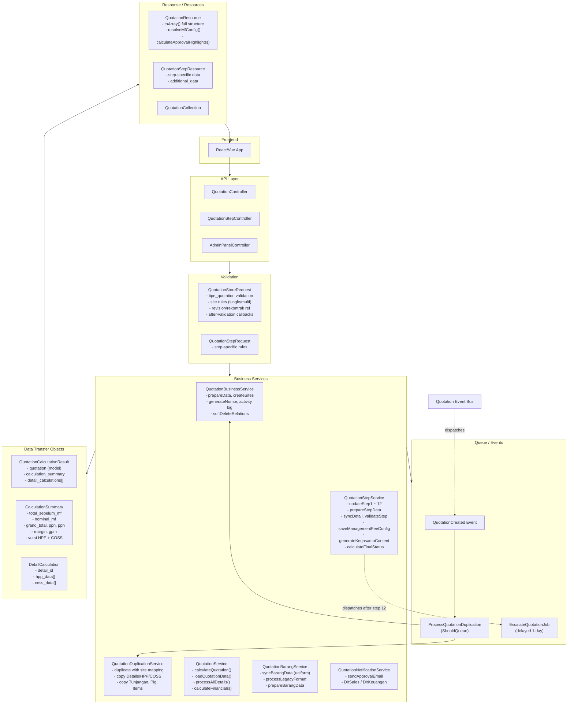

---

## 6. CALCULATION ENGINE — DETAILED SEQUENCE

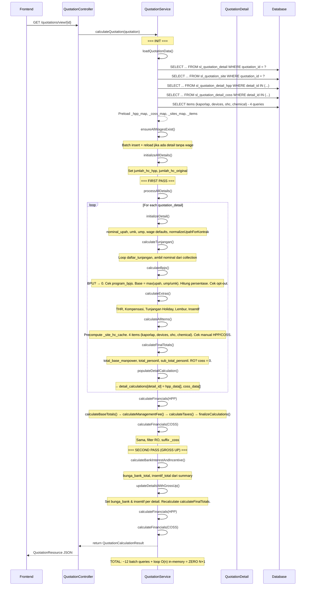

---

## 7. STEP UPDATE SEQUENCE

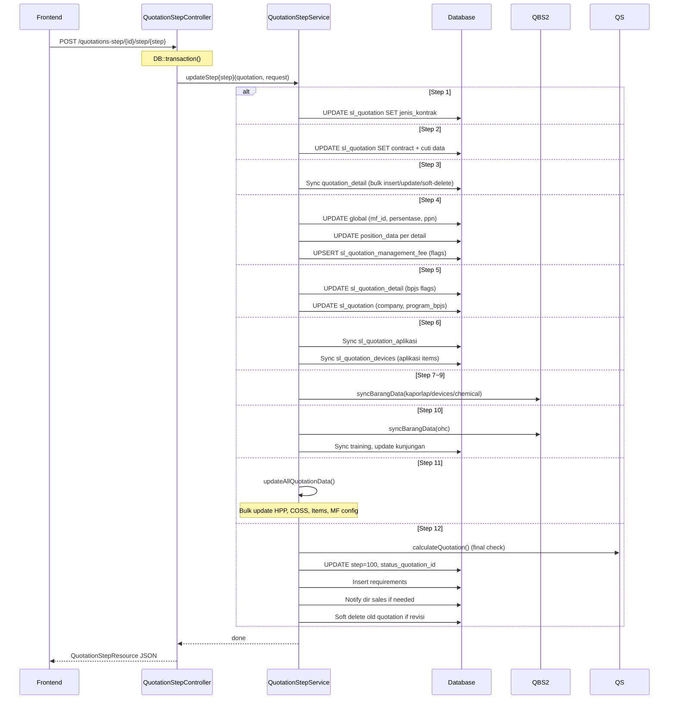

---

## 8. LEADS MODULE (30+ endpoints)

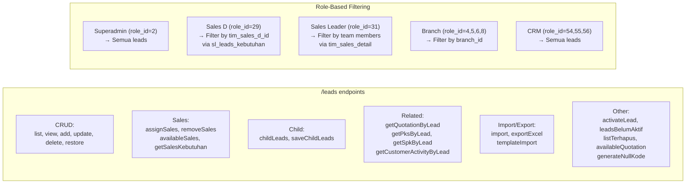

---

## 9. PKS MODULE

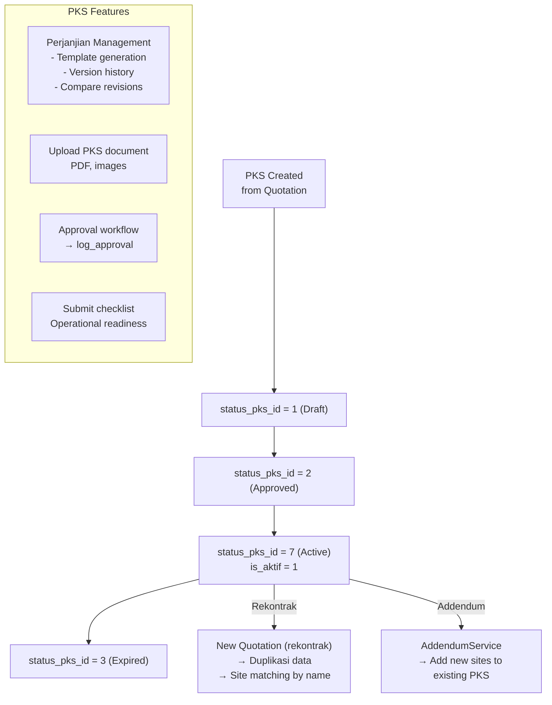

---

## 10. SPK MODULE

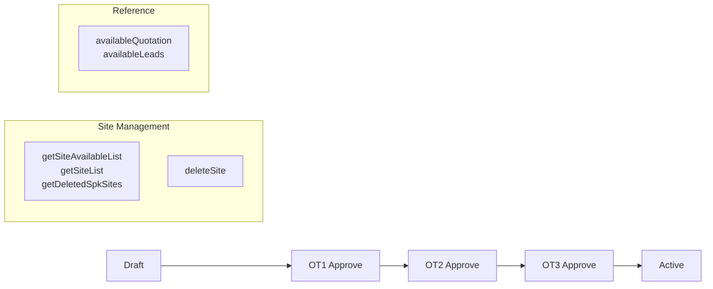

---

## 11. SALES MODULE

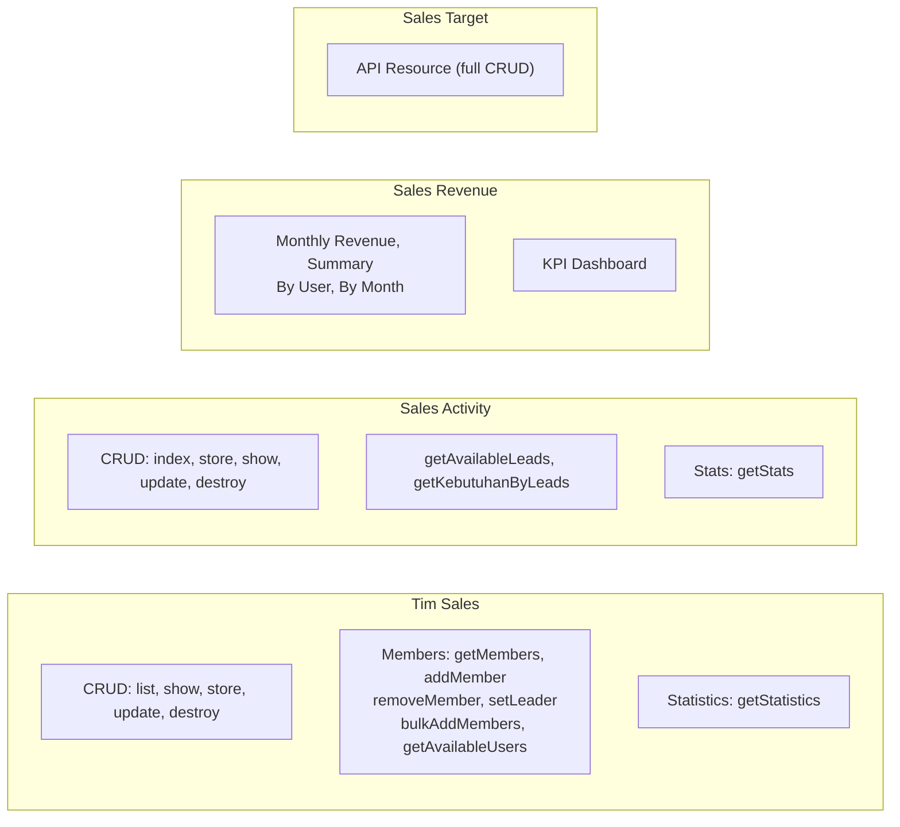

---

## 12. BUSINESS SUMMARY: 4 CORE CYCLES

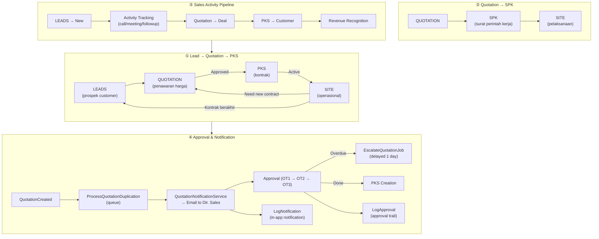

---

## 13. KEY NUMBERS SUMMARY

| Module | Controllers | Models | Services | Endpoints (≈) |
|--------|-------------|--------|----------|----------------|
| **Auth** | 2 | 5 | 0 | 6 |
| **Leads** | 1 | 10+ | 0 | 30+ |
| **Quotation** | 2 | 20+ | 6 | 25+ |
| **PKS** | 1 | 5+ | 1 | 25+ |
| **SPK** | 1 | 4+ | 0 | 15+ |
| **Sales** | 5 | 8+ | 1 | 30+ |
| **Customer** | 2 | 4+ | 0 | 8+ |
| **Master Data** | 18 | 30+ | 1 | 80+ |
| **Dashboard/Report** | 3 | 0 | 0 | 12+ |
| **System** | 4 | 8+ | 3 | 20+ |
| **Admin Panel** | 1 | 1 | 0 | 8+ |
| **Options** | 1 | 0 | 0 | 20+ |
| **Total** | **46** | **94** | **13** | **280+** |

---

## 14. APPROVAL FLOW HIERARCHY

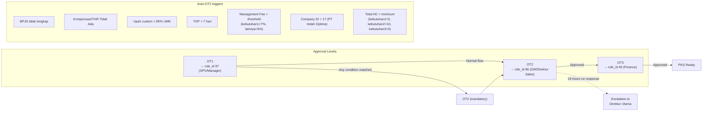

---

## 15. QUILL — KEY CONVENTIONS (from AGENTS.md)

| Convention | Rule |
|------------|------|
| **Controllers** | Thin, HTTP concerns only → delegate to Services |
| **Services** | Business logic, transactions, return DTOs/arrays |
| **Resources (3)** | `QuotationResource`, `QuotationCollection`, `QuotationStepResource` |
| **Requests** | Extend `BaseRequest` (not `FormRequest`) → consistent 422 format |
| **API Response** | `{ "success": true, "data": {}, "message": "..." }` |
| **SoftDeletes** | Every model |
| **Audit** | `created_by`, `updated_by`, `deleted_by` on every model |
| **Table prefix** | `sl_*` for business tables |
| **LeadsKebutuhan** | Use `updateOrCreate`, NOT `firstOrCreate` |
| **Quotation Multi-Site** | `$request->jumlah_site == "Single Site"` — exact case-sensitive match |
