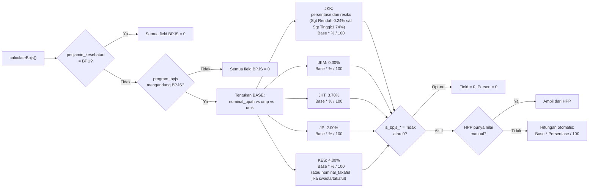

# CAIS Backend — Architecture & Flow

## 1. FULL CALCULATION ENGINE

```mermaid
flowchart TD
    ENTRY["calculateQuotation(quotation)"]
    ENTRY --> INIT["initializeQuotation()"]
    INIT --> LOAD["loadQuotationData()"]
    
    LOAD --> QD["QuotationDetail::with(wage, tunjangans)
    → quotation_detail"]
    QD --> QS["QuotationSite::where(quotation_id)
    → _sites_map[keyBy id]"]
    QS --> HPP["QuotationDetailHpp::whereIn(detailIds)
    → _hpp_map[keyBy detail_id]"]
    HPP --> COSS["QuotationDetailCoss::whereIn(detailIds)
    → _coss_map[keyBy detail_id]"]
    COSS --> TUNJ["Daftar tunjangan unik
    → _daftar_tunjangan
    (dari collection, zero query)"]
    TUNJ --> MF["ManagementFee::find(mf_id)
    → management_fee (cached)"]
    MF --> MFC["QuotationManagementFee::resolveForQuotation()
    → _mf_config"]
    MFC --> ITEMS["Items preload (4 queries batch):
    QuotationKaporlap → _kaporlap_items
    QuotationDevices → _devices_items
    QuotationOhc → _ohc_items
    QuotationChemical → _chemical_items
    (groupBy detail_id / site_id)"]

    ITEMS --> WAGE["ensureAllWagesExist()"]
    WAGE --> W1{"Detail tanpa wage?"}
    W1 -->|Ya| W2["QuotationDetailWage::insert(bulk)"]
    W1 -->|Tidak| WC
    W2 --> W3["QuotationDetailWage::whereIn(reload)"]
    W3 --> WC["setRelation('wage', ...) per detail"]
    
    WC --> SUM["jumlah_hc = sum(jumlah_hc)"]
    SUM --> PROV["provisi = calculateProvisi(durasi)"]
    PROV --> INITDETAILS["initializeAllDetails()
    → jumlah_hc_hpp = hpp->jumlah_hc ?? jumlah_hc
    → jumlah_hc_original = jumlah_hc"]

    INITDETAILS --> FP["=== FIRST PASS ==="]
    
    FP --> PD["processAllDetails()"]
    PD --> DETAILLOOP["foreach quotation_detail"]
    DETAILLOOP --> SD["processSingleDetail()"]
    SD --> INIDET["initializeDetail()
    → nominal_upah, umk, ump
    → wage defaults (upah, lembur, thr, dll)
    → normalizeUpahForKontrak()"]
    INIDET --> CD["calculateDetailComponents()"]
    CD --> CTUNJ["calculateTunjangan()
    → total_tunjangan
    → total_tunjangan_coss"]
    CTUNJ --> CBPJS["calculateBpjs()
    → BPU? (semua 0)
    → Cek program_bpjs
    → Base upah/ump/umk
    → Perhitungan JKK,JKM,JHT,JP,KES
    → Cek opt-out per komponen"]
    CBPJS --> CEXTRA["calculateExtras()
    → THR (base/12 atau dari wage)
    → Kompensasi (base/12 atau dari wage)
    → Tunjangan Holiday (dari wage)
    → Lembur flat (dari wage)
    → Insentif"]    
    CEXTRA --> CITEMS["calculateAllItems()
    → 4 item types: kaporlap, devices, ohc, chemical
    → Pre-compute _site_hc_cache (sekali per quotation)
    → Masing-masing cek manual value HPP/COSS
    → Jika null, compute dari items preloaded
    → Kaporlap: per detail_id
    → Devices/OHC/Chemical: per site_id"]
    CITEMS --> CFINAL["calculateFinalTotals()
    → total_base_manpower (upah + tunjangan)
    → total_personil (base + thr+komp+holiday+lembur+bpjs+items+bunga+insentif+bpu)
    → sub_total_personil = total_personil * jumlah_hc_hpp
    → RO: coss = 0
    → Versi COSS: total_personil_coss, sub_total_personil_coss"]
    CFINAL --> POP["populateDetailCalculation()
    → hpp_data[], coss_data[] untuk DTO"]
    POP --> DONE["→ detail_calculations[detail_id]"]

    DONE --> EOH{"Semua detail
    sudah diproses?"}
    EOH -->|Ya| CHPP["calculateHpp/Hpp()"]
    EOH -->|Tidak| DETAILLOOP
    
    CHPP --> CBASE["calculateBaseTotals()
    → total_sebelum_management_fee
    → total_base_manpower
    → upah_pokok
    → total_bpjs, total_bpjs_kesehatan
    → total_potongan_bpu
    → Aggregasi per-komponen:
      total_thr, total_kompensasi, total_thl,
      total_lembur, total_kaporlap, total_device,
      total_chemical, total_ohc, total_tunjangan_lain"]
    CBASE --> CMF["calculateManagementFee()
    → Base = upah_pokok
    → Tambah komponen aktif dari _mf_config
      (is_thr, is_kompensasi, is_thl, is_lembur,
       is_bpjs_kes, is_bpjs_tk, is_chemical,
       is_kaporlap, is_device, is_ohc, is_tunjangan_lain)
    → nominal_mf = base * persentase / 100
    → grand_total_sebelum_pajak = total + mf"]
    CMF --> CTAX["calculateDefaultTaxes()
    → is_ppn = Ya?
    → PPN 12%
    → PPH = management_fee * -2% (dibatasi max 10% base)
    → ppn_pph_dipotong: Management Fee / Lainnya"]
    CTAX --> FINAL["finalizeCalculations()
    → total_invoice = grand + ppn + pph
    → pembulatan = ceil(total/1000)*1000
    → margin = grand - total_sebelum_mf
    → gpm = margin/grand * 100"]

    FINAL --> CG["calculateCoss()
    → Filter RO dari aggregasi
    → Flow sama seperti HPP
    → Semua field pakai suffix _coss"]

    CG --> GR["=== SECOND PASS (Gross Up) ==="]
    GR --> BANK["calculateBankInterestAndIncentive()
    → bunga_bank_total = total_sebelum_mf * (persen_bunga_bank/100) / jumlahHc
    → insentif_total = nominal_mf * (persen_insentif/100) / jumlahHc
    → Non TOP: persen_bunga_bank = 0"]
    
    BANK --> UP["updateDetailsWithGrossUp()
    → Set bunga_bank & insentif per detail
    → Recalculate calculateFinalTotals
    → Update dto hpp_data & coss_data"]
    
    UP --> CHPP2["calculateFinancials() HPP (ulang)"]
    CHPP2 --> CG2["calculateFinancials() COSS (ulang)"]
    CG2 --> RETURN["RETURN QuotationCalculationResult
    → quotation (model)
    → calculation_summary (DTO)
    → detail_calculations[detail_id] (DTO)"]
```

---

## 2. BPJS CALCULATION DETAIL

---

## 3. STEP PROGRESSION — DATA PER STEP

```mermaid
flowchart LR
    subgraph S1["STEP 1"]
        S1D["jenis_kontrak
        layanan_id / kebutuhan_id"]
    end
    subgraph S2["STEP 2"]
        S2D["mulai_kontrak, kontrak_selesai
        tgl_penempatan, top
        salary_rule_id, pengiriman_invoice
        shift_kerja, hari_kerja, jam_kerja
        cuti, hari_cuti_*, gaji_saat_cuti
        evaluasi_*, durasi_*"]
    end
    subgraph S3["STEP 3"]
        S3D["Positions + HC
        (headCountData bulk format)"]
    end
    subgraph S4["STEP 4"]
        S4D["POSITION DATA:
        upah, hitungan_upah, nominal_upah
        lembur, kompensasi, thr
        tunjangan_holiday
        bpjs per position
        GLOBAL DATA:
        management_fee_id, persentase
        is_ppn, ppn_pph_dipotong
        management_fee_components (flags)"]
    end
    subgraph S5["STEP 5"]
        S5D["BPJS per position
        (is_bpjs_jkk/jkm/jht/jp/kes)
        penjamin_kesehatan
        nominal_takaful
        jenis_perusahaan, bidang_perusahaan
        resiko, program_bpjs"]
    end
    subgraph S6["STEP 6"]
        S6D["aplikasi_pendukung
        (daftar aplikasi yg dipilih)"]
    end
    subgraph S7["STEP 7"]
        S7D["Kaporlap / Seragam
        (barang + jumlah per detail)"]
    end
    subgraph S8["STEP 8"]
        S8D["Devices / Peralatan
        (barang + jumlah per site)"]
    end
    subgraph S9["STEP 9"]
        S9D["Chemicals
        (barang + jumlah + masa_pakai)"]
    end
    subgraph S10["STEP 10"]
        S10D["OHC (barang per site)
        Training
        Kunjungan operasional & CRM"]
    end
    subgraph S11["STEP 11"]
        S11D["Review & Edit
        Quotation PICs
        Full Calculation View"]
    end
    subgraph S12["STEP 12"]
        S12D["Final Confirm
        Kerjasama (perjanjian)
        → Step 100 = Completed"]
    end

    S1 --> S2 --> S3 --> S4 --> S5 --> S6
    S6 --> S7 --> S8 --> S9 --> S10 --> S11 --> S12
```

---

## 4. KEY FILES & METHODS

| File | Key Methods | Purpose |
|------|-------------|---------|
| `app/Services/QuotationService.php` | `calculateQuotation()` | Entry point, 2-pass calculation |
| | `loadQuotationData()` | Batch load all relasi (no N+1) |
| | `calculateAllItems()` | 4 item types, precomputed HC cache |
| | `calculateManagementFee()` | Dynamic component-based MF |
| | `calculateFinancials()` | HPP/COSS (base + MF + tax + final) |
| | `processSingleDetail()` | Per-detail: tunjangan, bpjs, extras, items, totals |
| `app/Services/QuotationStepService.php` | `updateStep1-12()` | Masing-masing handle 1 step |
| | `saveManagementFeeConfig()` | Upsert flag komponen MF |
| | `generateKerjasamaContent()` | Generate konten perjanjian |
| `app/Services/QuotationBusinessService.php` | `prepareQuotationData()` | Prepare data sebelum create |
| | `generateNomorByType()` | Generate nomor quotation |
| | `softDeleteQuotationRelations()` | Soft delete cascade |
| `app/Services/QuotationDuplicationService.php` | `duplicateQuotationWithSiteMapping()` | Revisi/rekontrak duplikasi |
| `app/Http/Controllers/QuotationController.php` | `availableLeads()` | Filter leads per tipe quotation |
| | `getReferenceQuotations()` | Dapatkan referensi untuk revisi/rekontrak |
| `app/Http/Controllers/QuotationStepController.php` | `buildStepDataStep4-12()` | Build step-specific response data |
| | `resolveMfConfig()` | Resolve management fee component flags |
| `app/Http/Resources/QuotationResource.php` | `toArray()` | Full quotation response structure |
| | `resolveMfConfig()` | Management fee component flags |
| | `calculateApprovalHighlights()` | Approval warning detection |

---

## 5. BUSINESS RULES

| Rule | Logic | File:Line |
|------|-------|-----------|
| **RO Exclusion** | `position_id === 224` → COSS = 0 | `QuotationService.php:1496` |
| **GC (General Cleaning)** | `jenis_kontrak = 'GENERAL CLEANING'` → bagi `hari_kerja` | `QuotationService.php:357,502` |
| **PKHL** | `jenis_kontrak = 'PKHL'` → `nominal_upah_bulanan = upah_harian * hari_kerja` | `QuotationService.php:1363` |
| **BPU** | `penjamin_kesehatan = 'BPU'` → semua BPJS 0, potongan 16800 | `QuotationService.php:688-704` |
| **Management Fee Components** | 11 flag komponen. Hanya komponen aktif yang masuk basis MF | `QuotationService.php:1204-1216` |
| **Persentase Threshold** | `kebutuhan_id=1?7:6` %. Di bawah = approval warning | `QuotationResource.php:72` |
| **Non TOP** | `top = 'Non TOP'` → `persen_bunga_bank = 0` | `QuotationService.php:997` |

---

## 6. API ROUTES MAP

| Method | Endpoint | Controller | Method |
|--------|----------|------------|--------|
| GET | `/api/quotations/list` | `QuotationController` | `index` |
| POST | `/api/quotations/add/{tipe}` | `QuotationController` | `store` |
| GET | `/api/quotations/view/{id}` | `QuotationController` | `show` |
| DELETE | `/api/quotations/delete/{id}` | `QuotationController` | `destroy` |
| GET | `/api/quotations/available-leads/{tipe}` | `QuotationController` | `availableLeads` |
| GET | `/api/quotations/reference/{leads_id}` | `QuotationController` | `getReferenceQuotations` |
| GET | `/api/quotations-step/{id}/step/{step}` | `QuotationStepController` | `getStep` |
| POST | `/api/quotations-step/{id}/step/{step}` | `QuotationStepController` | `updateStep` |
