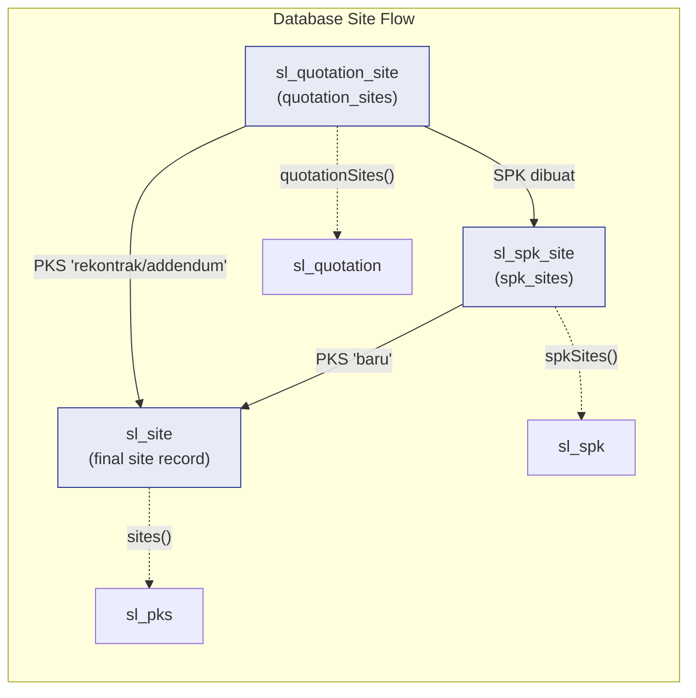
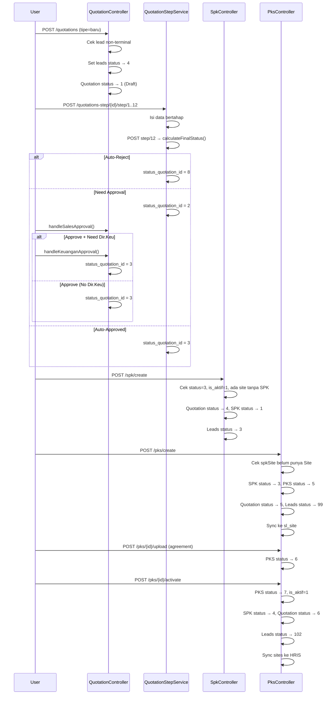

# FULL LIFECYCLE: Leads → Quotation → SPK → PKS

> Status IDs & business rules from actual codebase.  
> All conditions are verified against controller/service logic.

---

## 1. MASTER FLOWCHART

```mermaid
flowchart TD
    START(["📋 LEADS<br/>(sl_leads)"]) --> Q_BARU{"tipe_quotation? 
    ──────────────
    baru | revisi | rekontrak | addendum"}

    %% ───── BRANCH: BARU ─────
    Q_BARU -->|"baru"| BARU_COND{"status_leads_id 
    terminal? 
    ──────────
    99 (Deal)
    100 (Tidak Deal)
    101 (Bukan Leads)
    102 (Generated
    Customer)"}
    BARU_COND -->|"Tidak"| Q_CREATE_BARU["CREATE QUOTATION
    → status_quotation_id = 1 (Draft)
    → leads status → 4 (Quotation)
    → tipe_quotation = 'baru'"]
    BARU_COND -->|"Ya"| BARU_BLOCK["❌ Blocked:
    Terminal leads
    tidak bisa
    'baru' lagi"]

    %% ───── BRANCH: REVISI ─────
    Q_BARU -->|"revisi"| REVISI_COND{"Ada quotation 
    non-terminal? 
    ───────────
    status IN [2,3,4,5,6,7,8]
    (exclude Draft & 
    Terminated)"}
    REVISI_COND -->|"Ya"| Q_CREATE_REVISI["CREATE REVISI
    → Duplikasi data
    → Old quotation di-soft-delete
    → Status tetap apa adanya"]
    REVISI_COND -->|"Tidak"| REVISI_BLOCK["❌ Blocked:
    Tidak ada quotation
    untuk direvisi"]

    %% ───── BRANCH: REKONTRAK / ADDENDUM ─────
    Q_BARU -->|"rekontrak / addendum"| REKON_COND{"status_leads_id = 102?
    ─────────────────
    Wajib Generated Customer"}
    REKON_COND -->|"Tidak"| REKON_BLOCK["❌ Blocked:
    Lead belum Generated 
    Customer (102)"]
    REKON_COND -->|"Ya"| REKON_Q_COND{"Ada quotation 
    dengan:
    ──────────
    • status [3,6] 
      (Active / Site Active)
    • punya sites
    • sites punya PKS
      is_aktif=1"}
    REKON_Q_COND -->|"Ya"| Q_CREATE_REKON["CREATE REKONTRAK/ADDENDUM
    → Duplikasi dengan site mapping
    → Copy details, HPP, COSS, items
    → Site matching by name"]
    REKON_Q_COND -->|"Tidak"| REKON_Q_BLOCK["❌ Blocked:
    Tidak ada quotation 
    dengan PKS aktif"]

    %% ───── QUOTATION DRAFT LIFECYCLE ─────
    Q_CREATE_BARU --> Q_DRAFT["📋 QUOTATION (Draft)
    status_quotation_id = 1"]
    Q_CREATE_REVISI --> Q_DRAFT
    Q_CREATE_REKON --> Q_DRAFT
    
    Q_DRAFT --> STEP_NAV["Step 1-12 
    (isi data bertahap)"]
    
    STEP_NAV --> STEP12{"Step 12 selesai?
    ───────────────
    QuotationStepService
    calculateFinalStatus()"}
    
    STEP12 -->|"Auto-reject conditions<br/>(lihat §2)"| Q_REJECTED["QUOTATION REJECTED
    status_quotation_id = 8
    is_aktif = 0"]
    
    STEP12 -->|"Need Dir.Sales + Dir.Keu<br/>(lihat §1 kondisi)"| Q_PENDING_1["QUOTATION PENDING
    status_quotation_id = 2
    (Menunggu Approval)"]
    
    STEP12 -->|"Need Dir.Sales only"| Q_PENDING_2["QUOTATION PENDING
    status_quotation_id = 2
    (Menunggu Approval)"]
    
    STEP12 -->|"Auto-approved<br/>(tanpa approval)"| Q_ACTIVE["QUOTATION ACTIVE
    status_quotation_id = 3
    is_aktif = 1"]

    %% ───── APPROVAL PIPELINE ─────
    Q_PENDING_1 --> APPROVAL{"APPROVAL PIPELINE"}
    Q_PENDING_2 --> APPROVAL
    
    APPROVAL --> APPROVE_RS{"Dir.Sales approve?
    ─────────────
    QuotationController
    handleSalesApproval()"}
    APPROVE_RS -->|"Ya + perlu Dir.Keu"| APPROVE_RK{"Dir.Keuangan approve?
    ───────────────
    QuotationController
    handleKeuanganApproval()"}
    APPROVE_RK -->|"Ya"| Q_ACTIVE_STEP["QUOTATION ACTIVE
    status = 3"]
    APPROVE_RK -->|"Tolak"| Q_REJECTED_2["QUOTATION REJECTED
    status = 8"]
    
    APPROVE_RS -->|"Ya + tidak perlu Dir.Keu"| Q_ACTIVE
    APPROVE_RS -->|"Tolak"| Q_REJECTED_2
    APPROVE_RK -->|"Tidak ada respon 24 jam"| ESCALATE["ESCALATE ke 
    Direktur Utama
    (EscalateQuotationJob)"]

    %% ───── QUOTATION → SPK ─────
    Q_ACTIVE --> SPK_AVAIL{"Available untuk SPK?
    ──────────────────
    SpkController::availableQuotation()
    
    1. status_quotation_id = 3 ✓
    2. is_aktif = 1 ✓
    3. Ada quotationSites 
       tanpa spkSite ✓
    4. Filter by user role ✓"}
    
    SPK_AVAIL -->|"Ya"| SPK_CREATE["CREATE SPK
    → status_spk_id = 1 (Draft)
    → Quotation status → 4 (Generated SPK)
    → Leads status → 3 (SPK/Closing)*
    
    *kecuali leads sudah terminal
    (99,100,101,102)"]

    SPK_CREATE --> SPK_UPLOAD["UPLOAD SPK
    → status_spk_id = 2 (Uploaded/Signed)"]

    SPK_UPLOAD --> SPK_PKS{"Akan jadi PKS?
    ─────────────────
    Lihat §4"}

    %% ───── QUOTATION → PKS ─────
    Q_ACTIVE -.->|"Alternate path:<br/>Quotation → langsung PKS?"| PKS_AVAIL_ALT
    
    SPK_PKS -->|"Ya"| PKS_AVAIL{"Available untuk PKS?
    ─────────────────
    PksController::getAvailableLeadsData()
    
    1. Punya spkSites dengan SPK ✓
    2. spkSites BELUM punya
       Site (sl_site) ✓
    3. Filter by user role ✓"}
    
    PKS_AVAIL -->|"Ya"| PKS_CREATE["CREATE PKS
    → status_pks_id = 5 (Draft)
    → SPK status → 3 (Generated PKS)*
    → Quotation status → 5 (Generated PKS)*
    → Leads status → 99 (Deal)*
    
    *kecuali sudah terminated (100)"]

    PKS_CREATE --> PKS_SYNC["SYNC Sites
    → Insert ke sl_site
    → Relasi: pks_id, quotation_id,
      spk_id, spk_site_id, leads_id
    → Untuk 'baru': dari SpkSite
    → Untuk 'rekontrak': dari QuotationSite"]
    
    PKS_SYNC --> PKS_UPLOAD["UPLOAD AGREEMENT
    (PKS ditandatangani)
    → status_pks_id = 6 (Approved/Active)"]
    
    PKS_UPLOAD --> PKS_ACTIVATE["ACTIVATE SITES ke HRIS
    ─────────────────
    PksController::activate()
    
    1. PKS → 7 (Activated), is_aktif=1
    2. SPK → 4 (Site Telah Aktif)
    3. Quotation → 6 (Site Active)
    4. Leads → 102 (Generated Customer)
    
    → Sync ke HRIS database"]

    %% ───── REKONTRAK CYCLE ─────
    PKS_ACTIVATE -.->|"Kontrak berakhir"| REKON_LOOP_1["LEADS = 102 (Generated Customer)
    ───────────────────────
    + PKS is_aktif = 1
    + Quotation [3,6]"]
    REKON_LOOP_1 -.->|"Buat quotation baru"| Q_CREATE_REKON

    %% ───── STYLING ─────
    classDef blocked fill:#ffcccc,stroke:#ff0000,stroke-width:2px
    classDef active fill:#ccffcc,stroke:#00aa00,stroke-width:2px
    classDef decision fill:#fff3cc,stroke:#ffaa00,stroke-width:2px
    classDef process fill:#e1f5fe,stroke:#0277bd,stroke-width:1px
    classDef start fill:#f3e5f5,stroke:#7b1fa2,stroke-width:2px
    classDef rejected fill:#ffe0b2,stroke:#e65100,stroke-width:1px
    classDef pending fill:#fff9c4,stroke:#f9a825,stroke-width:1px
    classDef terminal fill:#e8f5e9,stroke:#2e7d32,stroke-width:2px

    class Q_BARU,APPROVAL,STEP12,SPK_AVAIL,PKS_AVAIL,REKON_COND,REKON_Q_COND,REVISI_COND,BARU_COND decision
    class Q_CREATE_BARU,Q_CREATE_REVISI,Q_CREATE_REKON,STEP_NAV,PKS_CREATE,PKS_SYNC,PKS_UPLOAD,PKS_ACTIVATE,SPK_CREATE,SPK_UPLOAD process
    class START start
    class Q_ACTIVE,QUOTATION_ACTIVE,Q_ACTIVE_STEP active
    class Q_REJECTED,Q_REJECTED_2 rejected
    class Q_PENDING_1,Q_PENDING_2 pending
    class PKS_ACTIVE terminal
    class BARU_BLOCK,REVISI_BLOCK,REKON_BLOCK,REKON_Q_BLOCK blocked
```

---

## 2. STATUS ID REFERENCE

### Leads (`sl_leads` → `status_leads_id`)

| ID | Nama | Kapan di-set |
|----|------|-------------|
| 1 | `New Lead` | Awal dibuat |
| 3 | `SPK/Closing` | SPK dibuat (`SpkController:517`) |
| 4 | `Quotation` | Quotation baru dibuat (`QuotationBusinessService:38`) |
| 99 | `Deal` | PKS dibuat (`PksController:2449`) |
| 100 | `Tidak Deal` | — |
| 101 | `Bukan Leads` | — |
| 102 | `Generated Customer` | PKS di-activate (`PksController:2999`) |

### Quotation (`sl_quotation` → `status_quotation_id`)

| ID | Nama | Kapan di-set |
|----|------|-------------|
| 1 | `Draft` | Awal dibuat |
| 2 | `Pending Approval` | Step 12 → butuh approval |
| 3 | `Active/Approved` | Approval selesai |
| 4 | `Generated SPK` | SPK dibuat |
| 5 | `Generated PKS` | PKS dibuat |
| 6 | `Site Active` | PKS di-activate |
| 7 | *(unnamed)* | Digunakan di query revisi |
| 8 | `Rejected` | Approval ditolak |
| 100 | `Terminated` | Dihapus/terminasi |

### SPK (`sl_spk` → `status_spk_id`)

| ID | Nama | Kapan di-set |
|----|------|-------------|
| 1 | `Draft` | Awal dibuat |
| 2 | `Uploaded/Signed` | File SPK diupload |
| 3 | `Generated PKS` | PKS dibuat |
| 4 | `Site Telah Aktif` | PKS di-activate |
| 100 | `Terminated` | Dihapus/terminasi |

### PKS (`sl_pks` → `status_pks_id`)

| ID | Nama | Kapan di-set |
|----|------|-------------|
| 5 | `Draft` | Awal dibuat |
| 6 | `Approved/Active` | Agreement diupload |
| 7 | `Activated` | Sites di-activate ke HRIS |

---

## 3. AUTO-REJECT & APPROVAL CONDITIONS

### Step 12 → Auto-Reject

Quotation **langsung direject** (status = 8) jika:

| Kondisi | Penjelasan |
|---------|-----------|
| `company_id = 17` | PT Indah Optima — selalu auto-reject |
| BPJS tidak lengkap | Program BPJS belum diisi |
| Kompensasi/THR tidak ada | Tunjangan kompensasi/THR kosong |
| Upah custom < 85% UMK | Upah di bawah threshold |
| TOP > 7 hari | Term of payment melebihi 7 hari |
| Management fee < threshold | Kebutuhan1=7%, lainnya=6% |
| Total HC < minimum | Kebutuhan1=5, Kebutuhan2=10, Kebutuhan3=5 |

### Step 12 → Approval Pipeline

**BUTUH Dir.Sales (OT1 → OT2)** jika memenuhi SALAH SATU:

| Kondisi | Penjelasan |
|---------|-----------|
| BPJS tidak lengkap | — |
| Kompensasi/THR Tidak Ada | — |
| Upah custom < 85% UMK | — |
| TOP > 7 hari | — |
| MF < threshold | Kebutuhan1=7%, lainnya=6% |
| Company ID = 17 | PT Indah Optima |
| Total HC < minimum | Kebutuhan1=5, Kebutuhan2=10, Kebutuhan3=5 |
| **taujnah tinggi** | Custom check tertentu |
| **harga > HPS** | Harga > Harga Perkiraan Sendiri |

**TAMBAHAN BUTUH Dir.Keuangan** jika memenuhi:

| Kondisi | Penjelasan |
|---------|-----------|
| Margin < target | — |
| Total nominal besar | Threshold internal |

### Normal Approval (Auto-Approved)

Jika tidak ada kondisi di atas, quotation auto-approved (status = 3, is_aktif = 1) tanpa perlu approval manual.

---

## 4. CONDITIONAL GATE SUMMARY

```mermaid
flowchart LR
    subgraph GATES["Decision Gates (Controller Methods)"]
        G1["GATE 1: availableLeads
        ──────────────
        QuotationController:892
        Filter by tipe_quotation"]
        
        G2["GATE 2: calculateFinalStatus
        ──────────────
        QuotationStepService:1604
        Auto-reject / Need approval / Auto-ok"]
        
        G3["GATE 3: availableQuotation SPK
        ──────────────
        SpkController:306
        status=3 + is_aktif=1 + 
        ada site tanpa SPK"]
        
        G4["GATE 4: getAvailableLeadsData
        ──────────────
        PksController:2819
        Ada spkSite + belum ada Site"]
    end

    LEADS[("LEADS")] --> G1
    G1 -->|"Quotation Created"| QUOTATION["QUOTATION"]
    QUOTATION --> G2
    G2 -->|"status=3 Active"| QUOTATION_OK["✅ QUOTATION READY"]
    QUOTATION_OK --> G3
    G3 -->|"SPK Created"| SPK["SPK"]
    SPK --> G4
    G4 -->|"PKS Created"| PKS["PKS"]
    PKS -->|"Activated"| DONE["✅ SITE ACTIVE
    Leads → 102 (Generated Customer)"]

    classDef gate fill:#fff3e0,stroke:#ff6f00,stroke-width:2px
    classDef ready fill:#e8f5e9,stroke:#2e7d32,stroke-width:2px
    classDef entity fill:#e3f2fd,stroke:#1565c0,stroke-width:2px
    
    class G1,G2,G3,G4 gate
    class LEADS,QUOTATION,SPK,PKS entity
    class QUOTATION_OK,DONE ready
```

---

## 5. SITE RELATIONSHIP MAP

---

## 6. FULL SEQUENCE (baru → PKS → Activated)

